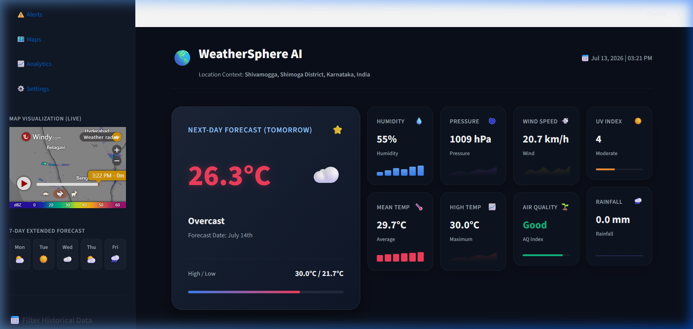
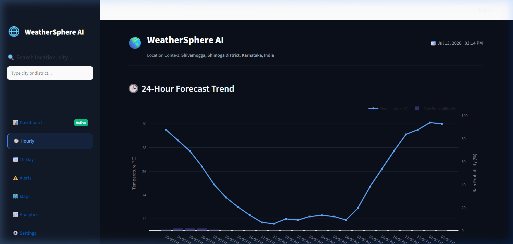
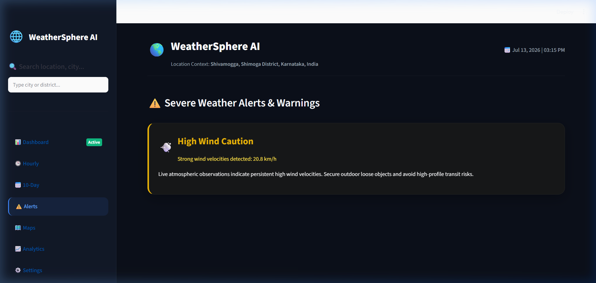

# WeatherSphere AI 🌎

WeatherSphere AI is a premium, end-to-end Machine Learning weather forecasting platform. It dynamically ingests 5 years of daily historical meteorological data for any city globally via the Open-Meteo Historical Weather API, performs time-series feature engineering, trains/optimizes tabular (Random Forest) and deep learning sequence-based (PyTorch LSTM, GRU, Bi-LSTM) models, and renders a live, high-fidelity analytics dashboard inside a Streamlit web server.

---

## 📖 Table of Contents
1. [Description](#-description)
2. [Features](#-features)
3. [Tech Stack](#-tech-stack)
4. [Project Structure](#-project-structure)
5. [Installation](#-installation)
6. [Usage](#-usage)
7. [Configuration](#-configuration)
8. [Screenshots/Demo](#-screenshotsdemo)
9. [API Reference](#-api-reference)
10. [Testing](#-testing)
11. [Contributing](#-contributing)
12. [Roadmap](#-roadmap)
13. [License](#-license)

---

## 📝 Description
WeatherSphere AI exists to bridge the gap between complex meteorology, machine learning, and clean user experience. While traditional forecast services rely heavily on physics-based simulation models (which are computationally heavy), WeatherSphere AI demonstrates that localized, sequence-aware machine learning models can learn temporal atmospheric shifts on the fly. 

By fetching a 5-year local climate profile of any city, it performs statistical time-series feature engineering (including lag steps and cyclical season conversions), trains prediction algorithms on local patterns, and updates real-time analytics dashboards.

---

## 🌟 Features
* **🔮 Next-Day Forecast**: Predictive insights dynamically calculated by the best-performing model (Random Forest or PyTorch LSTM).
* **🕒 Live 24-Hour Forecast**: Dynamic temperature trend curves and precipitation probability bars mapped directly from real hourly Open-Meteo telemetry.
* **📅 Live 10-Day Extended Forecast**: Dynamic forecast cards fetching 10-day high/low temperatures mapped to World Meteorological Organization (WMO) weather symbols.
* **⚠️ Dynamic Biometeorological Alert Panel**: Real-time environmental stress diagnostic alert system (extreme temperatures, low pressure, wind gusts) that displays health risks and guidelines.
* **🗺️ Interactive Map Visualizations**: Premium embedded Windy.com satellite weather radar widgets dynamically centered on your searched coordinates, both in the main dashboard and inside the sidebar.
* **⚙️ Deep Learning Model Studio**: Interactive dashboard panel to customize hidden layers, learning rate, batch size, and train a custom PyTorch sequence model on the fly with live MSE loss curves.

---

## 💻 Tech Stack
* **Core Language**: Python (>=3.9)
* **Frameworks & UI**: Streamlit (>=1.22.0)
* **Deep Learning**: PyTorch (>=2.0.0)
* **Classical ML**: Scikit-Learn (>=1.2.0)
* **Visualization**: Plotly (>=5.14.0), Matplotlib, Seaborn
* **Data Processing**: Pandas, NumPy
* **APIs**: Open-Meteo REST Forecast & Archive APIs, Geocoding API
* **Model Serialization**: Joblib

---

## 📂 Project Structure
```text
weathersphere-ai/
├── data/
│   ├── raw_weather.csv           # Ingested 5-year raw daily weather dataset
│   └── processed_weather.csv     # Transformed dataset with lags, rolling averages, and season encodings
├── docs/
│   └── architecture_design.md    # System Architecture & Design Specification
├── models/
│   ├── random_forest_model.joblib # Saved Random Forest baseline model
│   ├── lstm_model.pth            # Saved PyTorch LSTM model weights
│   ├── lstm_scaler.joblib        # Fitted features and target MinMaxScaler state objects
│   ├── best_model.txt            # Text file storing the name of the best performing model
│   ├── active_location.txt       # Active city/location name context
│   └── active_coordinates.txt    # Coordinates of current location context
├── outputs/
│   ├── metrics_comparison.csv    # Evaluated test metrics for both models
│   ├── actual_vs_predicted.png   # Overlaid test set forecast visualization
│   ├── rf_feature_importance.png # Top feature relative importances from Random Forest
│   └── latest_forecast.json      # Current weather status & next-day model prediction metadata
├── src/
│   ├── data_ingestion.py         # API fetching module for 5-year archives
│   ├── feature_engineering.py    # Lag, rolling statistics, and seasonal encodings
│   ├── train_random_forest.py    # Random Forest training & evaluation
│   ├── train_lstm.py             # PyTorch LSTM, GRU, and Bi-LSTM model definition & training
│   ├── evaluate.py               # Combined model validation and graph output generator
│   └── pipeline.py               # Orchestrator script for the training workflow
├── app.py                        # Premium glassmorphism Streamlit dashboard
├── generate_report_pdf.py        # PDF technical report builder script
├── requirements.txt              # Project package dependencies
└── README.md                     # Documentation (this file)
```

---

## ⚙️ Installation

### 1. Set Up the Virtual Environment
Activate the workspace-wide virtual environment in your terminal:

**Windows PowerShell:**
```powershell
.\.venv\Scripts\Activate.ps1
```

**Windows CMD:**
```cmd
.\.venv\Scripts\activate.bat
```

### 2. Install Project Dependencies
Install the required packages in your active environment:
```bash
pip install -r requirements.txt
```

---

## 🚀 Usage

### 1. Run the End-to-End ML Pipeline
To fetch data, pre-process it, train the machine learning and deep learning models, compare their RMSE/MAE metrics, and generate evaluation plots, execute the pipeline orchestrator:
```bash
python src/pipeline.py
```

### 2. Launch the Interactive Dashboard
Run the Streamlit application using the environment:
```powershell
.\.venv\Scripts\streamlit.exe run app.py
```

### 3. Training/Inference Code Example
Here is a snippet showing how WeatherSphere AI creates sequential inputs for the deep learning models:
```python
def create_sequences(features, targets, seq_length=7):
    X, y = [], []
    for i in range(len(features) - seq_length + 1):
        X.append(features[i : i + seq_length])
        y.append(targets[i + seq_length - 1])
    return np.array(X), np.array(y)
```

---

## 🛠️ Configuration
WeatherSphere AI manages its settings dynamically via flat text files in the `models/` directory:
* **`models/active_location.txt`**: Contains the label of the active city context (e.g., `Shivamogga, India`).
* **`models/active_coordinates.txt`**: Contains the comma-separated geocoding coordinates (e.g., `13.9315,75.5679`).
* **`models/best_model.txt`**: Declares which model outperformed the other on the validation set (`PyTorch LSTM` vs. `Random Forest`) and is selected as the default next-day predictor.

---

## 🖼️ Screenshots/Demo

Interactive screenshots captured from the verified WeatherSphere AI interface:

* **Windy.com Sidebar Weather Radar & Overview**:
  

* **Interactive Plotly 24-Hour Forecast Curve**:
  

* **Biometeorological Alert Panel & Health Guidelines**:
  

---

## 🔌 API Reference
The platform communicates with the following external endpoints:
1. **Geocoding API**: `https://geocoding-api.open-meteo.com/v1/search`
   - *Query Count*: 5 suggestions
   - *Language*: English
2. **Forecast API**: `https://api.open-meteo.com/v1/forecast`
   - *Parameters*: `hourly` (temperature, humidity, precipitation probability, weather code), `daily` (temperature max/min/mean, humidity mean, precipitation sum, pressure mean, weather code)
3. **Historical Archive API**: `https://archive-api.open-meteo.com/v1/archive`
   - *Date Range*: 5 years history up to 5 days ago

---

## 🧪 Testing
* **Syntax Validation**: Run syntax checks prior to committing modifications:
  ```bash
  python -m py_compile app.py
  ```
* **Integration Tests**: Execute pipeline scripts and ensure metrics output compiles correctly:
  ```bash
  python src/evaluate.py
  ```
* **PDF Report Generation**: Compile and export the PDF report:
  ```bash
  python generate_report_pdf.py
  ```

---

## 🤝 Contributing
1. Maintain documentation integrity. Keep comments and docstrings up to date.
2. Standardize variable mappings inside any custom data pipelines.
3. Keep layout containers responsive and responsive inside Streamlit (use `use_container_width=True` on Plotly figures).
4. Run syntax validation before proposing updates.

---

## 🗺️ Roadmap
* [ ] Add multi-city overlay forecasts for comparison.
* [ ] Integrate historical anomaly warnings comparing current metrics with 30-year climate averages.
* [ ] Support localized CSV upload profiles for cities/sensor arrays without Open-Meteo coverage.

---

## 📄 License
This project is licensed under the MIT License. See the `LICENSE` file for details.