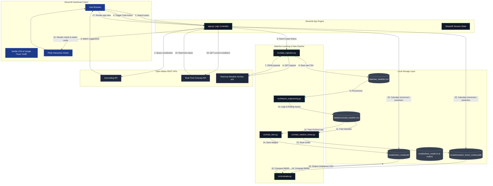

# WeatherSphere AI: System Architecture & Design Specification 🌎

This document details the **Front-End (User Interface)** and **Back-End (Data & Machine Learning)** architecture of **WeatherSphere AI**. It describes how the components integrate to deliver real-time, global weather predictions using Random Forest and Deep Learning (LSTM) models.

---

## 🏗️ System Architecture Overview



---

## 🎨 1. Front-End Architecture & Aesthetics

The user interface is designed to resemble a premium dark-themed SaaS control panel, focusing on **glassmorphism**, **custom typography**, and **responsive layouts**.

### A. Design System & Visual Tokens
*   **Font Family**: Google Fonts `'Outfit'` (designed for modern, tech-forward user interfaces).
*   **Background Theme**: Rich Midnight Blue (`#0b0f19`) to reduce eye strain and provide contrast for weather graphs.
*   **Accents**: Royal Blue (`#3b82f6`) for indicators, Emerald Green (`#10b981`) for successful operations, and Coral Red (`#f43f5e`) for predictions and warnings.
*   **Layout Panels**:
    *   **Hero Header Card**: Built with a CSS linear gradient transition:
        `linear-gradient(135deg, #1e40af 0%, #3b82f6 50%, #06b6d4 100%)`
        to immediately captivate users.
    *   **Live Weather Cards**: Structured as frosted glass components using vanilla CSS `backdrop-filter: blur(16px)` and translucent borders (`rgba(255, 255, 255, 0.08)`) to give visual depth.

### B. Interactive Dashboard Tab Layout
*   **Tab 1: 🔮 Next-Day Forecast & Live Observations**:
    *   A massive, glowing forecasting badge highlighting tomorrow's predicted temperature and which ML model is active.
    *   Six live-updating observation grid cards displaying current conditions (humidity, pressure, wind speed, precipitation, min/max range) pulled in real-time.
    *   A mixed-mode Plotly chart showing the last 14 days of actual temperatures linked by a dotted line to tomorrow's prediction star.
*   **Tab 2: 📈 Historical Analysis**:
    *   An interactive historical database explorer. Users can select custom dates to zoom, pan, and hover over 5 years of daily trends.
*   **Tab 3: ⚙️ Model Evaluation & Performance**:
    *   Shows structural comparisons between Random Forest and PyTorch LSTM.
    *   Loads actual test set evaluation images generated by the backend and outputs the test metrics table directly.

---

## ⚙️ 2. Back-End Architecture & Processing Engine

The back-end consists of five decoupled, scriptable Python modules under `src/` to ensure modularity.

```
src/
├── data_ingestion.py        # Connects to API & handles collection
├── feature_engineering.py   # Processes data & creates features
├── train_random_forest.py   # Trains baseline scikit-learn model
├── train_lstm.py            # Trains PyTorch LSTM deep sequence model
└── evaluate.py              # Evaluates test metrics & exports plots
```

### A. Core Modules
1.  **Data Ingestion (`data_ingestion.py`)**:
    *   Converts user-entered city coordinates to format a URL query for the Open-Meteo Historical Archive API.
    *   Pulls daily records of Mean, Max, and Min Temperatures, Relative Humidity, Precipitation, Wind Speed, and Sea-Level Pressure.
2.  **Feature Engineering (`feature_engineering.py`)**:
    *   **Lag Features**: Computes 1-day, 3-day, and 7-day lags to give the models historical short-term memory.
    *   **Rolling Statistics**: Calculates 7-day and 30-day rolling averages of temperature, humidity, and pressure to capture medium-term trends.
    *   **Seasonal Encodings**: Maps calendar months and days of the year into cyclical coordinates using Sine and Cosine functions:
        $$\sin\left(\frac{2\pi \cdot \text{month}}{12}\right), \cos\left(\frac{2\pi \cdot \text{month}}{12}\right)$$
        This prevents boundary issues (e.g. December/January transitions).
3.  **Model Training**:
    *   **Random Forest (`train_random_forest.py`)**: Establishes a baseline. It fits 100 decision trees on tabular features using all CPU cores in parallel (`n_jobs=-1`).
    *   **LSTM Network (`train_lstm.py`)**: Standardizes input dimensions using `MinMaxScaler` and creates 3D sequence arrays of window length $7$. Built with PyTorch:
        ```python
        class WeatherLSTM(nn.Module):
            def __init__(self, input_size, hidden_size=64, num_layers=2):
                super().__init__()
                self.lstm = nn.LSTM(input_size, hidden_size, num_layers, batch_first=True, dropout=0.2)
                self.fc = nn.Linear(hidden_size, 1)
        ```
4.  **Evaluation (`evaluate.py`)**:
    *   Scores both models on a test set (chronologically split 80% train / 20% test).
    *   Saves comparison CSV records and visualizes actual vs. predicted temperature plots on the test set.

---

## 🔄 3. Data Flow & Execution Sequence

When a user searches for a new city and hits **Fetch & Train AI Models**, the following control flow is executed synchronously:

```
[User Interface] ──(Selects Ahmedabad)──> [Geocoding API] (Resolves Lat/Lon)
                                                   │
[App Controller] <──(lat, lon, name)───────────────┘
       │
       ├─> Run [data_ingestion.py] ──> Saves raw_weather.csv
       │
       ├─> Run [feature_engineering.py] ──> Saves processed_weather.csv
       │
       ├─> Run [train_random_forest.py] ──> Saves models/random_forest_model.joblib
       │
       ├─> Run [train_lstm.py] ──> Saves models/lstm_model.pth & MinMaxScaler
       │
       ├─> Run [evaluate.py] ──> Saves models/best_model.txt & outputs/ plots
       │
       └─> Reruns app context and re-loads Real-Time Forecast values
```

---

## 🌟 Architectural Features for a "10/10" Project

1.  **Strict Modularity**: The backend code is fully decoupled. The pipeline can run entirely in a console via `python src/pipeline.py` or run interactively via the Streamlit web server.
2.  **Robust Error & Exception Handlers**:
    *   All file streams use `encoding='utf-8'` explicitly, preventing Unicode codec exceptions on Windows environments.
    *   Terminal logs are wrapped in try-except fallbacks, preventing unicode console crashes when processing international characters (such as `ā` in `Ahmadābād`).
3.  **Real-Time Data Alignment**: Current weather cards use live observations updated hourly from the forecast endpoints, ensuring the data is truly "present", while historical charts use the 5-year local database.
